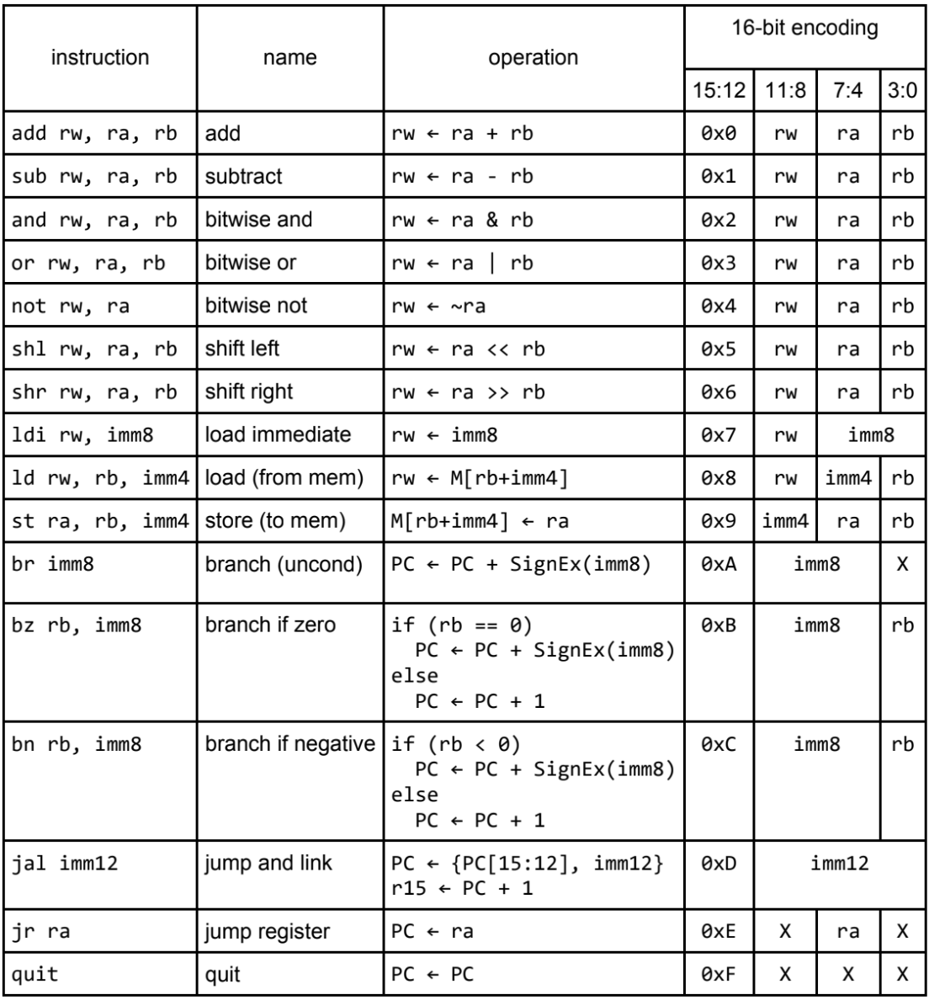

# 16-bit CPU Simulator

This is a fully functional 16-bit CPU Simulator with an interactive command line interface and an assembly-to-memory parser.

This project is based off of the Albacore processor outlined in ***Practical Logic and Processor Design with Verilog*** written by ***Jay Brockman***

## Usage

To create a memory file based off an assembly program, run the command:
`./asm2mem [input asm file] [output mem file]`

To simulate a program:
`./simulate_cpu [mem file]`

## Writing Programs

YOU, yes, YOU can write your own programs for this cpu simulator! Write your own assembly programs using the following 16 instructions:

Image credit: Practical Logic and Processor Design with Verilog, page 33

The parser takes in two compiler directives, .text and .data. Put any instructions after a .text directive, and any data after a .data directive. Look at the examples in the asm directory for help.

